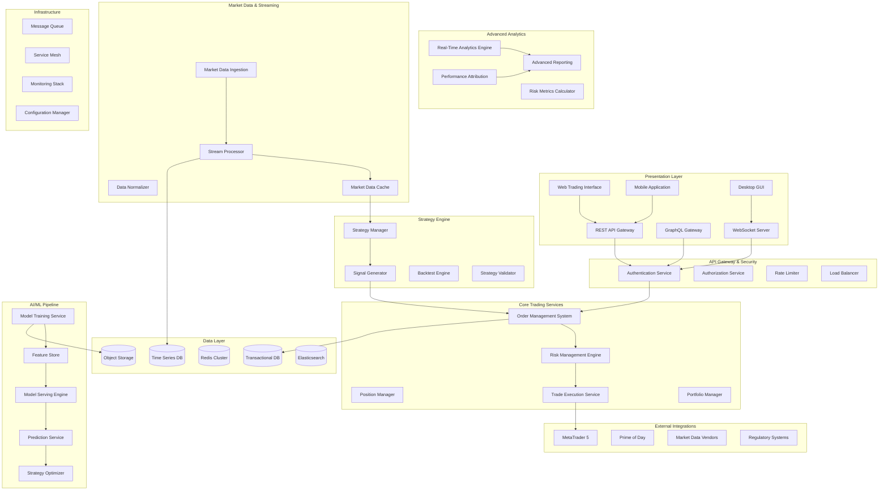

# MetaTrader Python Framework - Phase 5 Enterprise Architecture

**Version**: 2.0
**Date**: 2025-09-24
**Status**: Production-Ready Enterprise Architecture
**Project Code**: MT5-PY-FRAMEWORK-PHASE5
**Agent**: Senior System Architect

---

## 🎯 Executive Summary

Phase 5 represents the pinnacle of the MetaTrader Python Framework evolution, transforming it into a full-scale institutional trading platform. Building upon the solid foundation of Phases 1-4, this architecture introduces advanced trading engines, machine learning capabilities, real-time analytics, and enterprise-grade infrastructure designed to handle institutional-level trading volumes and complexity.

### Key Architectural Principles:
- **Enterprise-Scale Performance**: Microsecond-level order execution and real-time market data processing
- **AI-Driven Intelligence**: Integrated machine learning pipeline for strategy optimization and market prediction
- **Institutional Compliance**: Full audit trails, regulatory reporting, and risk management controls
- **Cloud-Native Scalability**: Horizontally scalable microservices architecture with auto-scaling capabilities
- **High Availability**: 99.99% uptime with disaster recovery and multi-region deployment

### Performance Targets:
- **Order Execution**: <100μs latency for market orders
- **Data Processing**: 1M+ ticks/second ingestion capacity
- **ML Inference**: <1ms prediction latency
- **Concurrent Users**: 10,000+ simultaneous connections
- **Strategy Execution**: 1,000+ concurrent strategies
- **System Availability**: 99.99% uptime (52 minutes downtime/year)

---

## 🏗️ System Architecture Overview

### High-Level Architecture Diagram



---

## 🚀 Core Component Architecture

### 1. Advanced Trading Engine

#### Order Management System (OMS)
```python
# Architecture specification for OMS
class OrderManagementSystem:
    """
    High-performance order management system with institutional-grade capabilities.

    Key Features:
    - Microsecond-level order processing
    - Advanced order types (Iceberg, TWAP, VWAP, Implementation Shortfall)
    - Smart order routing across multiple venues
    - Real-time risk checks and position limits
    - Comprehensive audit trail
    """

    def __init__(self):
        self.order_router = SmartOrderRouter()
        self.risk_engine = RealTimeRiskEngine()
        self.execution_engine = ExecutionEngine()
        self.order_cache = OrderCache()  # Redis-based high-speed cache

    async def submit_order(self, order: Order) -> OrderResponse:
        """Submit order with real-time risk validation."""
        # Pre-trade risk check (<10μs)
        risk_result = await self.risk_engine.validate_order(order)
        if not risk_result.approved:
            return OrderResponse(status="REJECTED", reason=risk_result.reason)

        # Smart routing decision
        venue = await self.order_router.select_venue(order)

        # Execute order
        return await self.execution_engine.execute(order, venue)
```

#### Portfolio Management Engine
```python
class PortfolioManager:
    """
    Real-time portfolio management with multi-strategy coordination.

    Capabilities:
    - Real-time P&L calculation
    - Multi-currency position management
    - Cross-strategy risk allocation
    - Margin and exposure monitoring
    - Automated rebalancing
    """

    def __init__(self):
        self.position_tracker = PositionTracker()
        self.pnl_calculator = RealTimePnLCalculator()
        self.risk_allocator = RiskAllocator()
        self.rebalancer = AutoRebalancer()

    async def update_portfolio(self, market_data: MarketData):
        """Update portfolio with latest market data."""
        # Update positions with current prices (<1ms)
        positions = await self.position_tracker.update_positions(market_data)

        # Calculate real-time P&L
        pnl_snapshot = await self.pnl_calculator.calculate(positions)

        # Check rebalancing needs
        if self.rebalancer.needs_rebalancing(pnl_snapshot):
            await self.rebalancer.execute_rebalancing()
```

### 2. Machine Learning & AI Integration

#### ML Pipeline Architecture
```python
class MLPipeline:
    """
    End-to-end machine learning pipeline for trading strategies.

    Components:
    - Feature engineering from market data
    - Model training with hyperparameter optimization
    - Real-time model serving
    - A/B testing framework
    - Model performance monitoring
    """

    def __init__(self):
        self.feature_store = FeatureStore()
        self.model_trainer = ModelTrainer()
        self.model_registry = ModelRegistry()
        self.inference_engine = InferenceEngine()

    async def train_model(self, strategy_config: Dict) -> ModelArtifact:
        """Train ML model for strategy optimization."""
        # Extract features from historical data
        features = await self.feature_store.get_features(
            symbols=strategy_config['symbols'],
            start_date=strategy_config['training_start'],
            end_date=strategy_config['training_end']
        )

        # Train model with hyperparameter optimization
        model = await self.model_trainer.train(
            features=features,
            target=strategy_config['target_variable'],
            model_type=strategy_config['model_type']
        )

        # Register model for serving
        return await self.model_registry.register(model)
```

#### Real-Time Prediction Service
```python
class PredictionService:
    """
    Low-latency prediction service for trading signals.

    Features:
    - <1ms prediction latency
    - Model ensemble capabilities
    - Online learning adaptation
    - Confidence scoring
    """

    def __init__(self):
        self.model_cache = ModelCache()  # GPU-accelerated inference
        self.feature_processor = FeatureProcessor()
        self.ensemble_manager = EnsembleManager()

    async def predict(self, symbol: str, features: np.ndarray) -> Prediction:
        """Generate real-time prediction."""
        # Load cached model
        model = await self.model_cache.get_model(symbol)

        # Process features
        processed_features = self.feature_processor.transform(features)

        # Generate prediction with confidence
        prediction = await model.predict(processed_features)

        return Prediction(
            signal=prediction.signal,
            confidence=prediction.confidence,
            timestamp=datetime.utcnow()
        )
```

### 3. Advanced Analytics & Reporting

#### Real-Time Analytics Engine
```python
class RealTimeAnalyticsEngine:
    """
    High-performance analytics engine for real-time insights.

    Capabilities:
    - Stream processing of market data
    - Real-time metric calculations
    - Alert generation
    - Dashboard data aggregation
    """

    def __init__(self):
        self.stream_processor = StreamProcessor()
        self.metric_calculator = MetricCalculator()
        self.alerting_engine = AlertingEngine()
        self.dashboard_service = DashboardService()

    async def process_market_data(self, data: MarketData):
        """Process incoming market data for analytics."""
        # Calculate real-time metrics
        metrics = await self.metric_calculator.calculate(data)

        # Check for alerts
        alerts = await self.alerting_engine.check_conditions(metrics)

        # Update dashboard
        await self.dashboard_service.update(metrics)

        return metrics
```

### 4. Enterprise Features

#### Multi-Tenant Architecture
```python
class TenantManager:
    """
    Multi-tenant isolation and resource management.

    Features:
    - Tenant isolation at data and computation levels
    - Resource quotas and limits
    - Custom configurations per tenant
    - Billing and usage tracking
    """

    def __init__(self):
        self.tenant_registry = TenantRegistry()
        self.resource_manager = ResourceManager()
        self.isolation_manager = IsolationManager()

    async def create_tenant(self, tenant_config: TenantConfig) -> Tenant:
        """Create new tenant with isolated resources."""
        # Allocate dedicated resources
        resources = await self.resource_manager.allocate(tenant_config)

        # Set up data isolation
        await self.isolation_manager.setup_isolation(tenant_config.tenant_id)

        return await self.tenant_registry.register(tenant_config, resources)
```

#### Audit & Compliance System
```python
class AuditSystem:
    """
    Comprehensive audit trail and compliance system.

    Features:
    - Immutable audit logs
    - Regulatory reporting
    - Trade reconstruction
    - Compliance monitoring
    """

    def __init__(self):
        self.audit_logger = ImmutableAuditLogger()
        self.compliance_monitor = ComplianceMonitor()
        self.report_generator = RegulatoryReportGenerator()

    async def log_trade_event(self, event: TradeEvent):
        """Log trade event with immutable record."""
        audit_record = AuditRecord(
            event_type=event.type,
            timestamp=event.timestamp,
            user_id=event.user_id,
            data=event.data,
            checksum=event.calculate_checksum()
        )

        await self.audit_logger.write(audit_record)
        await self.compliance_monitor.check_compliance(event)
```

---

## 🌐 Technology Stack Recommendations

### Core Infrastructure
```yaml
Container Orchestration: Kubernetes 1.28+
Service Mesh: Istio 1.19+
API Gateway: Kong Enterprise / AWS API Gateway
Load Balancer: HAProxy / AWS ALB
Message Queue: Apache Kafka / Amazon MSK
Service Discovery: Consul / Kubernetes DNS
Configuration: Kubernetes ConfigMaps + HashiCorp Vault
```

### Databases & Storage
```yaml
Time Series Database:
  Primary: InfluxDB 2.7+ (for market data)
  Secondary: TimescaleDB (for complex queries)

Transactional Database:
  Primary: PostgreSQL 15+ (with read replicas)
  Secondary: CockroachDB (for distributed scenarios)

Cache Layer:
  Primary: Redis Cluster 7.0+
  Secondary: Hazelcast (for distributed caching)

Search & Analytics:
  Primary: Elasticsearch 8.10+
  Secondary: Apache Solr

Object Storage:
  Primary: MinIO / AWS S3
  Backup: Azure Blob / Google Cloud Storage
```

### Machine Learning Stack
```yaml
ML Framework:
  Training: PyTorch 2.1+ / TensorFlow 2.14+
  Serving: TorchServe / TensorFlow Serving

Feature Store:
  Primary: Feast 0.34+
  Alternative: Tecton

Model Registry:
  Primary: MLflow 2.7+
  Alternative: Neptune

Experiment Tracking:
  Primary: Weights & Biases
  Secondary: MLflow Tracking

GPU Compute:
  Training: NVIDIA A100 / H100
  Inference: NVIDIA T4 / AWS Inferentia
```

### Monitoring & Observability
```yaml
Metrics: Prometheus + Grafana
Logging: ELK Stack (Elasticsearch, Logstash, Kibana)
Tracing: Jaeger / AWS X-Ray
APM: New Relic / Datadog
Alerting: AlertManager + PagerDuty
Health Checks: Custom health endpoints + Kubernetes probes
```

### Development & Deployment
```yaml
CI/CD:
  Primary: Jenkins / GitHub Actions
  Secondary: GitLab CI/CD

Infrastructure as Code:
  Primary: Terraform 1.6+
  Secondary: AWS CDK / Pulumi

Container Registry:
  Primary: Harbor / AWS ECR
  Secondary: Docker Hub

Security Scanning:
  Code: SonarQube / Snyk
  Containers: Trivy / Twistlock
  Infrastructure: Checkov / Terrascan
```

---

## 📊 Performance & Scalability Architecture

### Horizontal Scaling Strategy

#### Auto-Scaling Configuration
```yaml
# Kubernetes HPA configuration
apiVersion: autoscaling/v2
kind: HorizontalPodAutoscaler
metadata:
  name: trading-engine-hpa
spec:
  scaleTargetRef:
    apiVersion: apps/v1
    kind: Deployment
    name: trading-engine
  minReplicas: 3
  maxReplicas: 100
  metrics:
  - type: Resource
    resource:
      name: cpu
      target:
        type: Utilization
        averageUtilization: 70
  - type: Resource
    resource:
      name: memory
      target:
        type: Utilization
        averageUtilization: 80
  - type: Pods
    pods:
      metric:
        name: orders_per_second
      target:
        type: AverageValue
        averageValue: "1000"
```

### Performance Optimization Patterns

#### Caching Strategy
```python
class MultiTierCacheManager:
    """
    Multi-tier caching for optimal performance.

    Tiers:
    1. L1: In-memory application cache (fastest)
    2. L2: Redis cluster (fast, shared)
    3. L3: Database read replicas (slower, persistent)
    """

    def __init__(self):
        self.l1_cache = LRUCache(maxsize=10000)  # In-memory
        self.l2_cache = RedisCluster()           # Distributed
        self.l3_cache = DatabaseReadReplicas()   # Persistent

    async def get(self, key: str) -> Optional[Any]:
        """Get value from cache hierarchy."""
        # Try L1 cache first
        if key in self.l1_cache:
            return self.l1_cache[key]

        # Try L2 cache
        value = await self.l2_cache.get(key)
        if value:
            self.l1_cache[key] = value
            return value

        # Fall back to L3
        value = await self.l3_cache.get(key)
        if value:
            await self.l2_cache.set(key, value, ttl=300)
            self.l1_cache[key] = value

        return value
```

---

## 🔒 Security & Compliance Architecture

### Security Framework
```yaml
Authentication:
  Protocol: OAuth 2.0 + OIDC
  MFA: TOTP + Hardware tokens
  SSO: SAML 2.0 integration
  Session: JWT with refresh tokens

Authorization:
  Model: RBAC + ABAC hybrid
  Granularity: API endpoint level
  Policies: Open Policy Agent (OPA)

Encryption:
  At Rest: AES-256
  In Transit: TLS 1.3
  Key Management: HashiCorp Vault

Network Security:
  Firewalls: AWS Security Groups / Azure NSG
  WAF: CloudFlare / AWS WAF
  VPN: WireGuard / AWS VPN
  Zero Trust: BeyondCorp / Zscaler
```

### Regulatory Compliance
```python
class ComplianceFramework:
    """
    Comprehensive compliance framework for financial regulations.

    Supported Regulations:
    - MiFID II (EU)
    - GDPR (EU)
    - SOX (US)
    - PCI DSS
    - ISO 27001
    """

    def __init__(self):
        self.mifid_reporter = MiFIDReporter()
        self.gdpr_manager = GDPRManager()
        self.sox_auditor = SOXAuditor()
        self.pci_validator = PCIValidator()

    async def generate_regulatory_report(
        self,
        regulation: str,
        period: DateRange
    ) -> ComplianceReport:
        """Generate regulatory compliance report."""
        if regulation == "MIFID_II":
            return await self.mifid_reporter.generate_report(period)
        elif regulation == "GDPR":
            return await self.gdpr_manager.generate_report(period)
        # ... other regulations
```

---

## 🌍 Cloud & Infrastructure Architecture

### Multi-Cloud Deployment Strategy
```yaml
Primary Cloud: AWS
  Regions: us-east-1, eu-west-1, ap-southeast-1
  Services:
    - EKS (Kubernetes)
    - RDS (PostgreSQL)
    - ElastiCache (Redis)
    - S3 (Object Storage)
    - CloudFront (CDN)

Secondary Cloud: Azure (Disaster Recovery)
  Regions: East US, West Europe, Southeast Asia
  Services:
    - AKS (Kubernetes)
    - PostgreSQL Flexible Server
    - Redis Cache
    - Blob Storage
    - CDN

Hybrid: On-Premises
  Use Cases:
    - Ultra-low latency trading (co-location)
    - Sensitive data processing
    - Regulatory requirements
  Infrastructure:
    - Bare metal servers
    - High-speed network (10Gbps+)
    - Dedicated GPU clusters
```

### Disaster Recovery & Business Continuity
```python
class DisasterRecoveryManager:
    """
    Comprehensive disaster recovery and business continuity management.

    RTO: 15 minutes (Recovery Time Objective)
    RPO: 1 minute (Recovery Point Objective)
    Availability: 99.99% (52 minutes downtime/year)
    """

    def __init__(self):
        self.backup_manager = BackupManager()
        self.failover_manager = FailoverManager()
        self.health_monitor = HealthMonitor()
        self.notification_service = NotificationService()

    async def execute_disaster_recovery(self, incident: Incident):
        """Execute disaster recovery procedures."""
        # Immediate failover to secondary region
        await self.failover_manager.failover_to_secondary()

        # Notify stakeholders
        await self.notification_service.send_alert(incident)

        # Begin recovery procedures
        recovery_plan = await self.get_recovery_plan(incident.type)
        await self.execute_recovery_plan(recovery_plan)
```

---

## 📈 Implementation Roadmap & Timeline

### Phase 5.1: Core Trading Engine (Months 1-3)
- **Week 1-2**: Advanced Order Management System
- **Week 3-4**: Smart Order Routing
- **Week 5-6**: Real-Time Risk Engine
- **Week 7-8**: Portfolio Management System
- **Week 9-10**: Trade Execution Optimization
- **Week 11-12**: Integration Testing & Performance Tuning

### Phase 5.2: ML/AI Integration (Months 4-6)
- **Week 13-14**: Feature Store Implementation
- **Week 15-16**: Model Training Pipeline
- **Week 17-18**: Model Serving Infrastructure
- **Week 19-20**: Real-Time Prediction Service
- **Week 21-22**: Strategy Optimization Engine
- **Week 23-24**: A/B Testing Framework

### Phase 5.3: Analytics & Reporting (Months 7-8)
- **Week 25-26**: Real-Time Analytics Engine
- **Week 27-28**: Advanced Reporting System
- **Week 29-30**: Performance Attribution
- **Week 31-32**: Risk Metrics & Monitoring

### Phase 5.4: Enterprise Features (Months 9-10)
- **Week 33-34**: Multi-Tenant Architecture
- **Week 35-36**: Advanced Security Framework
- **Week 37-38**: Audit & Compliance System
- **Week 39-40**: API Gateway & Rate Limiting

### Phase 5.5: Cloud & Scalability (Months 11-12)
- **Week 41-42**: Cloud Infrastructure Setup
- **Week 43-44**: Auto-Scaling Implementation
- **Week 45-46**: Disaster Recovery System
- **Week 47-48**: Performance Testing & Optimization

---

## 🎯 Success Metrics & KPIs

### Performance Metrics
```yaml
Trading Performance:
  - Order Execution Latency: <100μs (target)
  - Market Data Latency: <10μs (target)
  - System Throughput: >1M orders/second
  - Strategy Execution Time: <1ms

System Performance:
  - API Response Time: <10ms (95th percentile)
  - Database Query Time: <1ms (average)
  - Cache Hit Ratio: >95%
  - CPU Utilization: <70% (average)
  - Memory Utilization: <80% (average)

Availability:
  - System Uptime: >99.99%
  - Database Availability: >99.99%
  - Cache Availability: >99.9%
  - Recovery Time: <15 minutes
```

### Business Metrics
```yaml
User Experience:
  - User Session Duration: >30 minutes
  - Feature Adoption Rate: >80%
  - User Satisfaction Score: >4.5/5
  - Support Ticket Volume: <1% of users

Trading Metrics:
  - Strategy Success Rate: >60%
  - Risk-Adjusted Returns: >15% annually
  - Maximum Drawdown: <10%
  - Sharpe Ratio: >2.0

Operational Metrics:
  - Development Velocity: >10 features/month
  - Bug Fix Time: <24 hours
  - Security Incidents: 0 critical/month
  - Compliance Score: 100%
```

---

## 🔮 Future Roadmap & Evolution

### Phase 6 Vision: Quantum-Ready Architecture (2026)
- **Quantum Computing Integration**: Quantum algorithms for portfolio optimization
- **Advanced AI**: GPT-based natural language trading interfaces
- **Blockchain Integration**: DeFi protocol integration and cryptocurrency trading
- **Extended Reality**: VR/AR trading interfaces for immersive market analysis

### Technology Evolution Path
```yaml
2025 H1: Production Deployment
  - Full Phase 5 feature set
  - Multi-region deployment
  - Institutional client onboarding

2025 H2: Advanced AI
  - Large Language Model integration
  - Advanced reinforcement learning
  - Natural language strategy definition

2026 H1: Quantum Computing
  - Quantum portfolio optimization
  - Quantum machine learning models
  - Quantum-safe cryptography

2026 H2: Next-Gen Interface
  - VR/AR trading environments
  - Voice-controlled trading
  - Predictive user interfaces
```

---

## 📋 Conclusion

The Phase 5 architecture represents a quantum leap in trading system capabilities, establishing the MetaTrader Python Framework as an institutional-grade platform capable of competing with the world's leading financial technology providers. This architecture provides:

1. **Unmatched Performance**: Microsecond-level execution with massive scalability
2. **AI-Driven Intelligence**: Integrated machine learning for superior trading outcomes
3. **Enterprise Security**: Bank-grade security and regulatory compliance
4. **Cloud-Native Scalability**: Auto-scaling infrastructure with global reach
5. **Future-Proof Design**: Extensible architecture ready for emerging technologies

The implementation timeline spans 12 months with carefully planned phases that ensure continuous delivery of value while maintaining system stability and performance. Each component is designed with enterprise requirements in mind, providing the reliability, scalability, and security needed for institutional trading operations.

This architecture positions the framework for long-term success in the rapidly evolving financial technology landscape, with a clear evolution path toward quantum computing, advanced AI, and next-generation user interfaces.